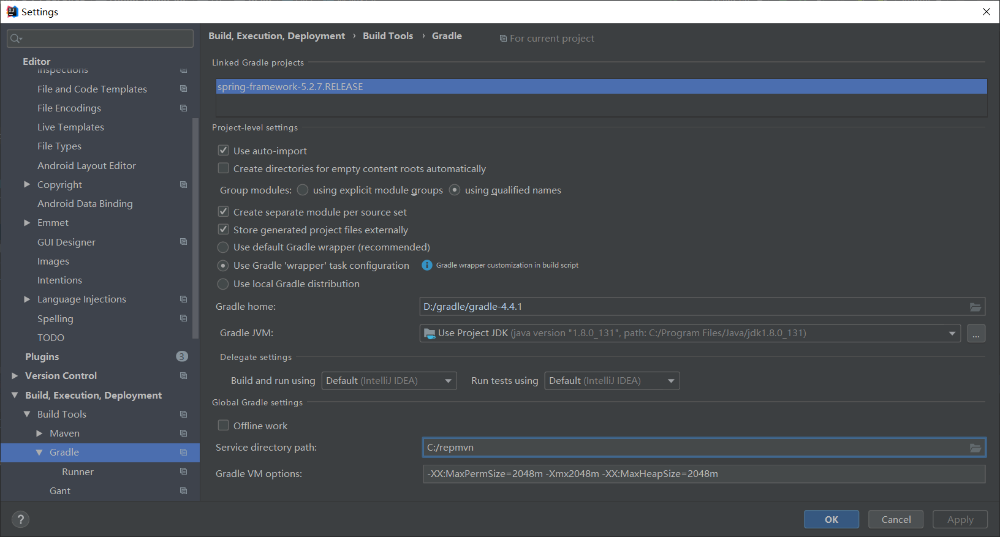

环境：window11+idea2020.3.4+jdk11+aspectj-1.9.6.jar

1、clone项目到本地，切换到5.3.x分支

2、修改build.gradle  
    这个文件就相当于我们Maven的pom.xml 管理项目的依赖等信息...
    设置镜像
    repositories {
        maven{ url 'https://maven.aliyun.com/nexus/content/groups/public/'}
        maven{ url 'https://maven.aliyun.com/nexus/content/repositories/jcenter'}
        mavenCentral()
        maven { url "https://repo.spring.io/libs-spring-framework-build" }
    }

3、编译compileTestJava模块
    打开源码所在文件夹，在windows cmd命令中输入，在windows中当前目录无需输入“./”。
    gradlew :spring-oxm:compileTestJava

4、导入项目到idea中
    导入项目到idea中：Import into IntelliJ (File -> New -> Project from Existing Sources -> Navigate to directory -> Select build.gradle)
    将项目导入到idea中提示配置gradle，按照如下配置

 导入后等待编译，莫急，需要一点点时间，编译完成：

5、添加测试模块代码： 添加测试代码：Code away
    new->model->gradle-->输入模块名称

错误解决方案：
    1、按照书中示例运行会报错：找不到符号：类 JCacheCacheAspect、JtaAnnotationTransactionAspect、AnnotationTransactionAspect 、AnnotationCacheAspect 、AnnotationAsyncExecutionAspect 、AnnotationBeanConfigurerAspect 具体如下：

    原因是spring源码的AOP使用了aspectj，而java不识别aspectj,https://www.eclipse.org/aspectj/downloads.php下载双击运行安装
    https://blog.csdn.net/cs373616511/article/details/107833530
    https://stackoverflow.com/questions/67296559/groovydynamicelementreader-cannot-be-resolved-to-a-type-when-i-build-spring-sour